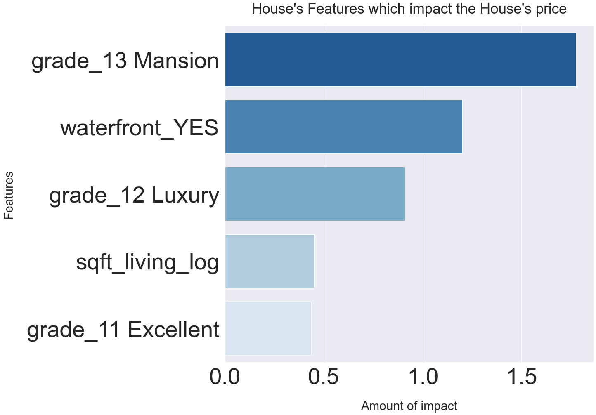

# Home Sales Prices

## Project Overview

The goal of this project is to use multiple linear regression modeling to predect the features which increase the houses prices in a king county.

### Business Problem

A real estate agency wants to provide advice to homeowners and homebuyers about how home renovations might increase the estimated value of their homes, and by what amount.

### The Data Understanding

This project uses the King County House Sales dataset, which can be found in kc_house_data.csv in the data folder. 
The dataset that I used included two types of variables :

1-Dependent variable (Home Prices) .

2-Independent variable like (Number of bedrooms,Number of bathrooms, Number of floors in house ,condition,grade,ext)

### Modeling

1. Baseline Model

For bulding the Baseline Model we need to discover which feature from the X_train data set has the highest colinearity with the target , we found that the Square footage of living space is the most strongly feater correlated with the target (price).
Now, we'll build a linear regression model using just the Square footage of living feature, which will serve as our baseline model.
Our baseline model explaining around 50% of variation  by the relationship between the dependent variable (price) and the independent variable (Square footage of living space in the home.

2.Second model:
Build a Model with All Numeric Features after converting all catogorical features to numerical.
Our Second model explaining around 64 % of variation  by the relationship between the dependent variable (price) and the independent variables all other features.
We noticeed on the model summary there are strong multicollinearity among the features.

3.Third model:
After removing some features from the previous model which shows high multicolinearity , we create a new model which explaining around 60 % of variation .

4.Forth model:
Create a model with the feature have significant impact to the model.The relationship between the dependent variable and the independent variables explains 60 % of the variation in the data.

### Regression Results
According to our final model,We got some houses features impact the house's price posatibvally .
That means if these features provided in the house the houses prices would increase.

The top five features increases the house prices are:

1-Grade_13 Mansion : Every 1 % increase in the independent variable ( grade13 Mansion ) can increase the price by 1.8 %

2-Waterfront : Every 1 % increase in the independent variable (waterfront) can increase the price by 1.2 %

3-Grade_12 Luxury : Every 1 % increase in the independent variable(grade12 Luxury) can increase the price by 
.91 %

4-Squre footage living : Every 1 % increase in the independent variable (sqftliving) can increase the price by
.45%.

5-Grade_11 Excellent : Every 1 % increase in the independent variable (grade11 Excellent) can increase the price by 0.44%.

### Conclusion

Conclusions and Recommendations
Based on our model when homeowners improve some features on thier homes ,their home's values increase as well. The top renovation, remodeling focuse on the home's grade , home's conditions ,home's squrefootage living and adding more floors and if the home has waterfront view:

1- Improve the grade : The grade concept refers to the quality of materials and quality of workmanship used during the building process.Buildings of better quality (higher grade) cost more.

Top three Classification by construction quality are:

*Grade-13 mansion : A mansion will be built on a large property and spesific architactal design either classical-style, colonial-style, or Victorian-style,with tall cellings ,large enteries and windows. Mansions are built of premium materials such as high-grade wood, superior stonework, customized fabrics and furnishings, marble countertops, ornate granite mantelpieces, Most modern mansions will also use smart and energy-efficient technologies it will have features more than a first-class hotel..The home meets these criteria Approaching the Mansion level thier prices would icreased around 380% .

*grade_12 Luxury : Some homes described as luxurious and impressive .This means house will offer a lot more than basic home functionality,an excess amount of bedrooms and bathrooms and additional rooms built specifically for a singular purpose like (theater , gyms,pool,spa rooms these homes also built with a very high quality materials. Quality can be observed, such as solid, level floors, plumb walls, smooth plastered wall/ceiling areas, mitered woodwork joints, properly fit doors and windows, are all indications of better quality workmanship. The Luxury feature can increase the home's price around 147%.

*grade_11 Excellent: The residence is in perfect or near perfect condition. Residence is either new or all items that can normally be replaced, repaired Examples are new roofing, siding, new paint, new interior finish, heating system.This feature can increase the price around 54 % .

2-Waterfront houses: If most people were given the choice, they would prefer to live near a body of water. Oceanfront, relative to rivers and lakes, has generally been demonstrated as having more impact on residential property value. A great view will fetch around 25% than homes at the same conditions without waterside. waterfront feature can increase the price around 225 % .

3-Improve the square footage of interior housing living space: Every 1 unit in square footage increase leads price to increase by 18% While it’s possible to gain additional living space by expanssion the main floor or add a new floor both choices are a great way to enlarge a bedroom or add new floor space for general use. expanssion the main floor to 1.5 floors can increases the house's price by 33 %. expanssion the the floors to 2.5 floors can increases the house's price by 22 %

4-Conditions :

The fact that critical parts of the house, like plumbing, electrical, the roof, and appliances are in Updates and upgrades can add value to the home, especially in older homes that may have outdated features. However, not all home improvement projects are created equally prices lncrease.

*Very Good :All items are well maintained, many having been replaced or updated. Repairs and refinishing are not needed this feature can increase the price by 44 %

*Good : No obvious maintenance required, but neither is everything new. Short lived items such as interior floor coverings, roofing show few signs of wear and have several years of life remaining. Only minor repairs or refinishing would be needed to put the property in a good condition and this feature increases the price by 14%.

### For more information

Email :mays802004@ gmail.com
GitHub :maysasaad

### Repository Structure

├── data
├── images
├── README.md
├── Presentation.pdf
└── Jupyter notebook.ipynb

