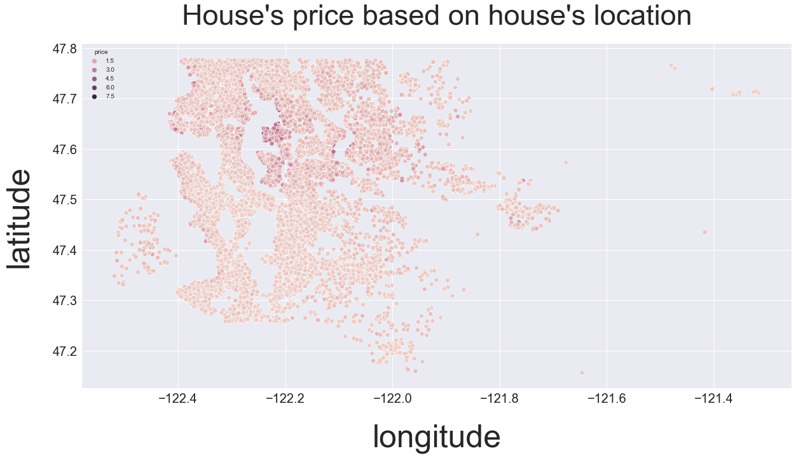
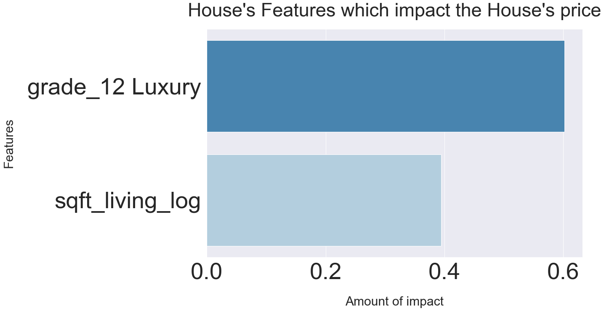

# Home Sales Prices

## Project Overview

In this project, we'll perform multiple linear regression analysis and report the findings of the final model, including both predictive model performance metrics and interpretation of fitted model parameters.

### Business Problem

The goal of this project is to develop a pricing algorithm to help real estate agents providing advice to homeowners about how home renovations might increase the estimated value of their homes, and by what amount.

The main purpose of this algorithm is predictive, meaning that uses multiple linear regression modeling to predict how sales prices in King County increase based on home features.
### The Data Understanding

This project uses the King County House Sales dataset, found in kc_house_data.csv in the data folder. Includes two types of variables :

1-Dependent variable (Home Prices).

2-Independent variables like (Number of bedrooms, Number of bathrooms, Number of floors in the house, condition, grade, ext) for 21,597 homes in King County,Washington sold in 2014-2015

### Modeling

1. Baseline Model

For building the Baseline Model we need to discover which feature from the X_train data set has the highest colinearity with the target, we found that the Square footage of living space is the most strongly feater correlated with the target (price).
Now, we'll build a linear regression model using just the Square footage of living features, which will serve as our baseline model.
Our baseline model explains around 50% of variation by the relationship between the dependent variable (price) and the independent variable (Square footage of living space in the home.

2.Second model:

Build a Model with All Numeric Features after converting all categorical features to numerical ones.
Our Second model explains around 82 % of variation by the relationship between the dependent variable (price) and the independent variables and all other features.
We noticed on the model summary there is strong multicollinearity among the features.

3.Third model:

After removing some features from the previous model which shows high multicollinearity, we create a new model which explains around  87 % of the variation but when test the p value ,we found that:
𝑝 >= 0.05 :Fail to reject,the null hypothesis. There is no relationship between the features of our model and the target (price)
We suspect our model's issues are related to multicollinearity, so we try to narrow down those features.

4.Forth model:

Creating a model with the features has a significant impact on the model. The relationship between the dependent variable and the independent variables explains 87 % of the variation in the data.

### Regression Results

1- Our final model explains 87 % of the variation in the data by clarifying the relationship between the price and home features.

2-Based on our model we found that some home features impact home prices positively which means when these features were provided home values increase as well.

3-The features that increase the price are (ZIP Codes, Homes grades, Waterfront houses, Housing living space, Conditions, and Square footage of the lot).

### Conclusion and Recommendations

According to our results when homeowners improve some features of their homes, their home values also increase.

We recommended that homeowners should perform enhancement in these areas:

1-Improve the Homes grade :

The grade concept refers to the home architectural design and quality of constraction materials, and workmanship used during the building process.

Some homes are described as luxurious and impressive. This means the house will offer a lot more than basic home functionality, an excess amount of bedrooms and bathrooms, and additional rooms explicitly built for a singular purpose like (theater, gyms, pool, and spa rooms these homes are also made with very high-quality materials. Quality can be observed, such as solid, level floors, plumb walls, smooth plastered wall/ceiling areas, mitered woodwork joints, and properly fit doors and windows, which are all indications of better quality workmanship. The Luxury feature can increase the home's price by around 0.60% for every 1% increase in this feature.

2-Improve the Homes living space: Every 1% increase in sqft living, our price increases by about 0.39 % While it’s possible to gain additional living space by adding a new floor a great way to enlarge a bedroom or add new floor space for general use. adding the second floor can increase the price by around 0.03% for every 1% increase in this feature.

### Next Steps
Further analyses could yield additional insights to further improve the model performance.

### For more information

Email :mays802004@ gmail.com
GitHub :maysasaad

### Repository Structure

├── data
├── images
├── README.md
├── Presentation.pdf
└── Jupyter notebook.ipynb

